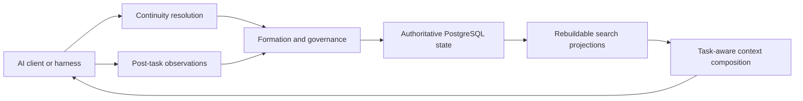

# Vermory

**Governed Memory for AI**

[](https://github.com/samekind/Vermory/actions/workflows/ci.yml)
[](LICENSE)

[Chinese documentation](README.zh-CN.md)

Vermory is a reality-first memory and context continuity platform for AI clients. It is designed for coding agents, web chat, assistants, and other tools that need to continue real work without mixing unrelated projects, reviving stale facts, or turning every conversation into permanent memory.

The canonical repository is [`samekind/Vermory`](https://github.com/samekind/Vermory).
Historical evidence may link to the former `jstar0/Vermory` repository and is
preserved without rewriting. See
[ADR 0002](docs/adr/0002-canonical-repository-move.md).

Vermory is more than a memo store. Its core problem is deciding:

- which continuity the current interaction belongs to;
- which observations deserve durable memory;
- which source is authoritative when facts conflict;
- which facts are current, superseded, local, global, or deleted;
- what context a specific AI task should receive;
- how every formation, correction, recall, bridge, and deletion remains explainable.

## Continuity Model

Vermory organizes continuity by anchor strength rather than by arbitrary content categories.

| Mode | Anchor | Expected behavior |
|---|---|---|
| Workspace-backed continuity | Repository root, workspace path, manifest, explicit workspace binding | The same workspace can continue across supported coding clients; different workspaces remain isolated. |
| Conversation-backed continuity | Thread, channel, contact, named matter, explicit topic | Everyday matters can continue across conversations without merging unrelated topics. |
| Global Defaults | Explicit stable user preferences and long-lived settings | A deliberately thin layer; temporary task instructions must not silently become permanent defaults. |

Cross-mode operations such as promote, link, export, adopt, and rebind are governed bridge actions, not implicit mixing.

## Product Invariants

The current constitution requires:

- zero forbidden cross-tenant and cross-continuity leakage in labeled hard-gate cases;
- no automatic strong-anchor merge when binding is ambiguous;
- no stale or superseded fact represented as current;
- no deleted target returned through exact, paraphrased, semantic, cached, historical, or adapter-backed recall;
- live repository and source reality can correct stale descriptive memory;
- model inference cannot silently override explicit user intent;
- PostgreSQL remains authoritative while search projections stay disposable and rebuildable;
- mem0, MemOS, Supermemory, and future systems remain optional projection adapters rather than second sources of truth.

See the [Product Constitution](docs/superpowers/specs/2026-07-11-vermory-product-constitution.md).

## Current Status

Vermory is in evidence-driven development.

Experiment 0 is complete. It provides:

- a strict reality-case manifest and JSONL event contract;
- source authorization, anonymization, fixture hashing, and path containment checks;
- deterministic `fixture-lock.json` generation and mutation detection;
- public and `withheld_local` evidence levels without fake local sealing;
- exact-artifact external-evaluation submissions plus Ed25519 verification for submission-bound attestations received from an external sealed evaluator;
- twenty-two frozen public cases spanning workspace continuity, conversation continuity, Global Defaults, deletion, source injection, durable bridges, OpenClaw and Hermes real-client continuity, authenticated multi-tenant RLS, PostgreSQL recovery, automatic conversation review, verified tool-outcome formation, protected artifact signing, trusted workspace attachment, the three-client bridge contract, durable Linux service lifecycle, and the external withheld-evaluation protocol;
- JSON and Markdown Experiment 0 reports.

The repository also contains production-shaped runtime slices for workspace and conversation continuity, Global Defaults, durable bridges, explicit source-authoritative revision, governed keyed source candidates, provider-assisted closed-set matching for unkeyed trusted source facts, bounded multi-fact formation from trusted documents, the OpenClaw external-turn lifecycle, an authenticated multi-tenant HTTP profile, native PostgreSQL recovery, an opt-in active-only pgvector runtime, versioned semantic projection generations with measured candidate promotion gates, a PostgreSQL transactional-outbox fault profile, and a qualified original LongMemEval oracle sample. A source candidate can be proposed without changing current AI context, rejected without changing the active fact, or accepted to atomically replace the still-current keyed target. When a trusted source lacks an internal key, a provider may select exactly one key from the current same-scope closed set or abstain. For one bounded trusted document, a provider may also propose up to sixteen exact-span `new`, `update`, or `unchanged` items; Vermory validates the entire frozen batch and still requires operator acceptance for every new or changed fact. A real Grok MCP task consumed only accepted facts after projection rebuild and wrote its result back as proposed. The production retrieval path uses durable PostgreSQL projection events, a fixed-tenant restricted worker, direct SiliconFlow `BAAI/bge-m3`, explicit lexical/shadow/vector modes, exact lexical degradation for projection lag or provider outage, and side-by-side active/candidate profiles with independent cursors, vectors, audits, rebuilds, and explicit cutover decisions; lexical remains the default and the measured v2 profile remains a candidate. A disposable-cluster W11 run additionally proves bounded backlog processing, provider retry, at-least-once replay, immediate PostgreSQL restart during embedding, same-pool recovery, deletion winning over late completion, and direct-provider recovery without requiring Redis. W12 qualifies the named `server-qualification-v1` profile with 550,000 governed memories, 100,000 current lexical and vector rows, 1,000,000 retained projection events, 1,000 concurrent deletions, competing tenant workers, zero final lag, zero scope leakage, and a direct-provider post-scale probe; current-authority bootstrap embeds only current facts instead of replaying obsolete history. All 1,000 scoped queries returned the expected current memory, but 412 of 550 requested vector queries used the controlled lexical fallback, so this is an operational and degradation qualification rather than a server-scale semantic-recall claim. The authenticated profile uses server-issued digest-only tokens, role-gated routes, a non-owner PostgreSQL runtime identity, tenant-aware foreign keys, and RLS on the served continuity graph. Recovery evidence covers migration replay, native dump/restore, projection rebuild, runtime-role re-provisioning, bounded database outage recovery, PostgreSQL 18 streaming standby promotion, and exact-LSN PITR with post-recovery credential governance. Pull-request CI starts PostgreSQL 18 and automatically runs the database-backed Go suite, runtime race gates, release build, and the OpenClaw install/check/package chain on a clean Ubuntu runner. The LongMemEval evidence runs six official records through no-context, full-history, plain-retrieval, and production Vermory-packet conditions with a real Grok reader; it is reported as `dataset_sample`, not a full benchmark score. Each evidence document is scoped to the exact client, model, failure mode, and deterministic hard gates it executed; no individual slice is treated as proof that the complete platform is finished.

Follow-up audit attribution showed that every degraded W12 vector request was
an intentional `projection_lag` fallback while concurrent delete events were
pending. A separate 100,000-vector control with a current projection completed
all 550 vector requests without degradation, so no scoped-HNSW production
change was made. See [Vector Degradation Attribution](docs/evidence/2026-07-15-vector-degradation-attribution.md).

W14 then executed every record in the pinned cleaned LongMemEval-S artifact:
500 isolated conversation continuities, 23,867 governed session memories, and
470 scored retrieval queries with zero runtime or scope failures. At K=10,
production lexical retrieval measured RecallAll `0.7340`, below the same-text
token-overlap baseline at `0.8383`; multi-session RecallAll was `0.5620`. The
result is a full qualified-dataset retrieval diagnosis, not a QA score or a
claim that lexical is optimal. See
[LongMemEval-S Full Retrieval Evidence](docs/evidence/2026-07-15-longmemeval-s-full-retrieval.md).

W15 then replayed the frozen K=10 rankings through 1,000 isolated real-reader
tasks with `grok-composer-2.5-fast` and a custom upstream-prompt `grok-4.5`
judge. Both conditions completed 500/500 tasks with zero terminal reader or
judge failures. Plain token overlap scored `0.7580` custom-judge accuracy;
Vermory lexical scored `0.6820`, with paired outcomes `310` both correct, `69`
plain only, `31` Vermory only, and `90` neither. The regression is retained;
the run does not change the lexical default or rank models. See
[LongMemEval-S Full Reader QA Evidence](docs/evidence/2026-07-15-longmemeval-s-full-reader-qa.md).

W28 then qualified the registered candidate vector path over all 500 cleaned
LongMemEval-S records without changing the production default. Direct
SiliconFlow `BAAI/bge-m3` projected 23,867 governed session memories through a
UTF-8 chunked, normalized-mean profile and completed 500/500 effective vector
queries with zero degradation, runtime failure, or scope/lifecycle violation.
At K=10, vector RecallAll was `0.9404`, compared with token overlap `0.8383`
and Vermory lexical `0.7340`; vector nDCG was `0.9069`. The one-memory durable
projection took `7,210.157s`, incurred 1,088 retried provider attempts, and
therefore remains an explicit operational cost rather than a hidden success
condition. The candidate remains inactive and lexical remains the default. See
[LongMemEval-S Full Vector Retrieval Evidence](docs/evidence/2026-07-20-longmemeval-s-full-vector-retrieval.md).

W30 then attempted to replay the frozen lexical and vector rankings through
direct domestic reader and judge models. The v1 reader completed 32 tasks
before the SiliconFlow account began returning `403` / code `30001` for
insufficient balance; 45 terminal failures were retained and the judge was not
started. A later exact-head `34d0402` availability check reached both frozen
models and received the same account response, so v2 was not created. Neither
run contributes an answer-quality score. See the
[rejected v1 evidence](docs/evidence/2026-07-20-longmemeval-s-domestic-vector-reader-qa-rejected-v1.md)
and the
[exact-head availability check](docs/evidence/2026-07-21-w30-provider-availability-34d0402.md).

W16 then qualified a dedicated PostgreSQL 18 physical-recovery trajectory. A
streaming standby reached the primary flush LSN, the dedicated primary was
stopped with immediate mode, the transition Web Chat request produced zero
receipt and zero rows, and the same handler/runtime/auth pools recovered after
standby promotion. A separate PITR restore stopped at target LSN `0/402ACE0`;
the restored authority fingerprint exactly matched T2, excluded the later
deletion/revocation and fact C, rebuilt three active lexical projections, then
re-revoked the historically restored token before a new operator token was
accepted. The run retained its setup and archive-command failures. It is
same-host qualification, not cross-host HA, automatic failover, or an SLO. See
[PostgreSQL HA And PITR Qualification Evidence](docs/evidence/2026-07-16-postgresql-ha-pitr.md).

W17 then qualified an active-backlog dimensional migration without changing
the default profile. Four tenants retained 20,000 current facts while the
active `vector_1024` profile and candidate `halfvec_2560` profile consumed
5,000 revision/delete/new-fact tail events. All 320 scoped incumbent queries
succeeded with zero cross-scope result; an immediate PostgreSQL restart
committed zero partial candidate row and advanced no interrupted cursor; the
same pools recovered; both classes converged to 20,000 rows with zero lag; and
candidate reset/rebuild left incumbent rows and authority unchanged. A direct
SiliconFlow `Qwen/Qwen3-Embedding-4B` probe returned and used 2,560 dimensions
in two requests. The candidate remains unpromoted and lexical remains default.
See [Active-Backlog Dimensional Migration Evidence](docs/evidence/2026-07-16-active-backlog-dimensional-migration.md).

W19 then qualified current-use eligibility independently from durable history.
The formal PostgreSQL 18 profile created 10,000 governed memories across four
tenants and twenty continuities, completed `320 / 320` scoped queries, returned
all 4,000 current facts, and produced zero scheduled, expired, archived,
deleted, Global Default, or cross-scope misuse. Projection rebuild, immediate
restart, and restore preserved effective fingerprints without reviving
forgotten content. Real Grok Web Chat, Grok MCP, and official Codex MCP
trajectories were bound into the report; a direct SiliconFlow `BAAI/bge-m3`
probe used 1,024 dimensions in exactly two requests. All sixteen gates passed.
Expiry and archive preserve inspectable history and are not deletion claims;
working input still requires separate governance before it becomes durable
memory. See [Memory Eligibility And Retention Evidence](docs/evidence/2026-07-16-memory-eligibility-retention.md).

W20 qualified the official Hermes `v0.18.2` CLI as a real conversation client.
Two isolated Hermes sessions remained separate until an explicit Vermory link;
after linking, a direct SiliconFlow `deepseek-ai/DeepSeek-V4-Flash` turn used
exactly one confirmed current memory and returned the current synthetic thesis
bundle. Reversing the link reduced a fresh session-B delivery to zero bytes.
When only the Hermes-specific Vermory canary was stopped, Hermes still returned
a visible model answer while Vermory recorded no false persistence receipt.
The model audit, user-level Mac mini LaunchAgent restart, deterministic package,
and privacy gates all passed. See [Hermes Real-Client Continuity Qualification](docs/evidence/2026-07-18-hermes-real-client.md).

W21 closes one real conversation write-back loop. OpenClaw persisted the user
turns, direct SiliconFlow `deepseek-ai/DeepSeek-V4-Flash` formed reviewable
candidates, the operator accepted three and rejected one lifecycle-only item,
and a later correction superseded Friday with Saturday at 10:00. A turn-local
English request produced no candidate and no Global Default. After forgetting
the synthetic access code, exact occurrences were zero across governed memory,
observations, answers, delivery history, lexical projection, formation runs,
formation items, and the checked isolated OpenClaw state. A fresh real
OpenClaw/Grok turn answered with Saturday at 10:00 and the concierge
requirement. Cross-continuity input, outside-manifest evidence, offline replay,
input drift, active-snapshot drift, and fail-open behavior were also exercised
on the Mac mini. The report retains provider timeouts, invalid output,
client-answer failures, and the deletion-audit defect that was found and fixed.
See [Conversation Formation Loop Qualification](docs/evidence/2026-07-18-conversation-formation-loop.md).

W22 makes conversation formation asynchronous and reviewable inside the real
client. Completed OpenClaw and Hermes turns enqueue durable same-continuity
work without waiting for a model. A restricted fixed-tenant worker forms
proposed candidates from exact user evidence; separate operator credentials
drive `/vermory memories`, `accept`, `reject`, `correct`, and `forget` without
registering a model tool. The accepted Mac mini run formed three thesis
candidates, accepted bundle and deadline, rejected an office, superseded
Tuesday with Wednesday, then forgot the deadline. Real OpenClaw/Grok recall
returned only current accepted facts. A separate official Hermes session
formed C-204 in its own inbox with zero OpenClaw leakage. Worker stop/restart,
client-role denial, completion replay, RLS, package, checksum, and privacy
gates passed without `sudo` or Mac mini NewAPI. See
[Automatic Conversation Formation And Review Qualification](docs/evidence/2026-07-18-automatic-conversation-review.md).

W24 qualifies protected artifact signing. The ordinary pull-request test job
builds and verifies a deterministic manifest covering all four Go archives,
GoReleaser checksums, OpenClaw, Hermes, and the Hermes sidecar without receiving
OIDC authority. A separate same-repository post-test job uses GitHub OIDC and
pinned Cosign `v3.0.6` to sign that complete manifest, verifies the exact
workflow identity and issuer, and rejects both a modified manifest and a wrong
workflow identity. The signed artifact was streamed through the Qingdao
reverse-management tunnel and independently verified on an ARM64 Mac mini with
no `sudo`, system-wide Cosign install, private signing key, tag, or GitHub
Release. `test` and `sign-snapshot` are strict required checks. See
[Protected Artifact Signing Qualification](docs/evidence/2026-07-18-protected-artifact-signing.md).

W32 qualifies the loopback Web Chat as a real Chrome application. It preserves
threads across refresh, isolates unrelated conversations, persists an operation
before sending, recovers both refused requests and lost successful responses
without duplicate turns, and exposes candidate review, correction, and
forgetting through the browser. Desktop and mobile layouts passed with a fresh
PostgreSQL authority. The deterministic provider isolates the browser contract
and is not a model-quality claim. See
[Browser Web Chat Lifecycle Qualification](docs/evidence/2026-07-22-browser-webchat-lifecycle.md).

W37 qualifies trusted workspace attachment against six exact public
repositories spanning Go, Rust, Python, Node.js, a memory-platform monorepo,
and an agent-platform monorepo. Repository-root and real nested-directory
probes, bounded attachment round-trip, six isolated PostgreSQL continuities,
exact prepare replay, alternate-namespace abstention, and cross-tenant
isolation passed all 18 gates. This is evidence for those exact checkouts, not
a claim that every repository or Git implementation is supported, and it does
not make remote URLs or shared history automatic merge authority. See
[Real Repository Corpus Qualification](docs/evidence/2026-07-23-real-repository-corpus.md).

I05 qualifies the durable service lifecycle on exact-head Ubuntu 24.04 AMD64
and native ARM64 runners with systemd and PostgreSQL 18. A dedicated non-login
identity and
restricted database role served an authenticated loopback boundary; governed
state survived upgrade, a failing release rolled back automatically, explicit
rollback worked in both directions, and a private native backup restored into an
empty database with runtime grants, projections, token authentication, and the
governed default intact. All 16 lifecycle and credential gates passed on both
architectures. This does not claim long-duration uptime/SLA, backup encryption,
or database migration rollback. See
[Durable Linux Service Lifecycle Qualification](docs/evidence/2026-07-22-durable-linux-service-lifecycle.md).

I06 qualifies the native Linux package boundary. DEB and RPM artifacts were
installed and removed on native AMD64 and ARM64 runners; all four installed
binaries matched the exact source revision and architecture, all 16 package
gates passed, and installation neither activated the service nor created
credentials or ran database migrations. The exact accepted package bytes were
then incorporated into the 12-entry GitHub OIDC-signed pull-request snapshot,
with every package hash matching its native acceptance report. This qualifies
signed package artifacts, not an APT/DNF repository, tagged publication,
distribution-specific DNF upgrades, uptime/SLA, or database migration rollback.
See [Native Linux Package Qualification](docs/evidence/2026-07-22-linux-native-packages.md).

I08 qualifies the next repository boundary without weakening I06's exact-byte
contract. Signed APT and DNF repository bundles for AMD64 and ARM64 contain the
same package bytes accepted by the native I06 jobs. Native package managers
installed Vermory from `file://`, enforced repository metadata signatures,
rejected modified metadata, preserved service non-activation, and passed all
18 hard gates on all four legs. The exact four bundles entered the verified
16-entry GitHub OIDC-signed snapshot. This qualifies ephemeral CI repository
signing and portable repository bundles, not a stable production signing key,
public hosting, mirrors, retention, cross-version upgrades or rollback, tagged
publication, or RPM payload signatures. See
[Native Linux Package Repository Qualification](docs/evidence/2026-07-23-linux-package-repository.md).

I09 qualifies one explicit cross-version repository lifecycle. Frozen base and
exact candidate DEB/RPM packages were installed through native APT/DNF on
AMD64/ARM64, normally upgraded, protected from implicit downgrade, explicitly
rolled back to the retained base, normally upgraded again, and finally removed.
All four legs passed 26 hard gates while preserving operator configuration and
the service identity, keeping the service inactive and disabled, and performing
no database migration. The qualification-only versions are not release
promises, and this does not claim a stable production signing key, public
hosting, retention, unattended updates, database migration rollback, tagged
publication, or RPM payload signatures. See
[Cross-Version Linux Repository Lifecycle Qualification](docs/evidence/2026-07-23-linux-repository-lifecycle.md).

I11 qualifies an authenticated macOS user-service lifecycle on the ARM64 Mac
mini. An OIDC-signed exact-revision candidate passed version and read-only
database compatibility preflight, unprivileged loopback LaunchAgent startup,
incompatible candidate and rollback rejection, upgrade, restart, explicit
rollback, failed-activation automatic restoration, governed-state preservation,
credential scans, and residue-free cleanup. All 20 hard gates passed. OpenClaw
and Hermes backend probes remained usable after the lifecycle, but this run does
not claim model quality or new real-client qualification. It also does not claim
database down migration, arbitrary historical rollback, zero downtime,
long-duration SLA, notarization, public exposure, or system-wide installation.
See [macOS Authenticated Service Lifecycle Qualification](docs/evidence/2026-07-23-macos-authenticated-service-lifecycle.md).

Read the current [Capability And Evidence Matrix](docs/capability-evidence-matrix.md)
for exact qualification boundaries. The
[Experiment 0 report](docs/experiment-0-readout.md) is retained as the initial
evidence-freezing baseline.

## Architecture Direction



The final physical schema, memory taxonomy, lifecycle names, ranking algorithm, API shape, universal SLOs, and deployment profiles are intentionally not frozen. `server-qualification-v1` is one measured profile, not a universal production envelope. These choices remain falsifiable hypotheses until real trajectories discriminate them.

## Quick Start

Requirements:

- Go `1.25.7` or a compatible newer toolchain;
- `jq` for inspecting generated evidence;
- PostgreSQL only for commands that exercise the native backend or legacy vertical slice.

Run the test suite:

```bash
go test ./...
go test -race ./internal/reality
go vet ./...
```

Inspect the CLI:

```bash
go run ./cmd/vermory --help
```

Run the loopback Web Chat application and open `http://127.0.0.1:8787`:

```bash
go run ./cmd/vermory web-chat \
  --database-url "$VERMORY_DATABASE_URL" \
  --tenant-id local \
  --listen 127.0.0.1:8787 \
  --provider mock
```

The mock provider is useful for verifying the browser lifecycle. Select a
direct provider explicitly when validating model behavior.

Validate the frozen public cases:

```bash
go run ./cmd/vermory reality-validate \
  --case-root reality/cases \
  --artifact-root ./artifacts \
  --run-id experiment-0-public-v1
```

Generate the Experiment 0 readout:

```bash
go run ./cmd/vermory experiment-0 \
  --case-root reality/cases \
  --artifact-root ./artifacts \
  --run-id experiment-0-v1
```

Generated artifacts are written below `artifacts/` and are intentionally not committed.

Trusted local ingestion can replace one named active fact with a newer source
revision without overwriting unrelated workspace memory:

```bash
go run ./cmd/vermory memory revise-source \
  --database-url "$VERMORY_DATABASE_URL" \
  --tenant-id local \
  --repo-root /absolute/workspace \
  --operation-id release-manifest-v2 \
  --memory-id '<superseded-memory-id>' \
  --source-ref repo:release-manifest@v2 \
  --content 'Use pnpm exec release:verify --mode locked.'
```

`revise-source` records source authority. `memory correct` remains the separate
user-authoritative correction path. Neither command guesses a target from
semantic similarity.

See [Explicit Source Revision Runtime Evidence](docs/evidence/2026-07-14-source-revision-runtime.md)
for the frozen software-release case, PostgreSQL lifecycle and rebuild gates,
real Grok MCP replay, preserved Codex quota/model failures, and exact claim
boundary.

When an ingestor supplies a trusted stable fact key, `memory propose-source`
creates a reviewable candidate without changing current retrieval. Operators
use `memory accept-candidate` or `memory reject-candidate`; ordinary MCP clients
never receive proposed or rejected content. See
[Source Conflict Candidate Runtime Evidence](docs/evidence/2026-07-14-source-conflict-candidate-runtime.md)
for the complete rejection, acceptance, rebuild, cross-tenant, stale-probe, and
real Grok MCP path.

When a trusted source has exact content and revision identity but no internal
key, `memory match-source` asks a configured provider to choose exactly one key
from the current workspace's closed set or abstain. The provider cannot invent
authority or activate memory; a valid match creates the same reviewable source
candidate used above.

```bash
go run ./cmd/vermory memory match-source \
  --database-url "$VERMORY_DATABASE_URL" \
  --tenant-id local \
  --repo-root /absolute/workspace \
  --operation-id release-signing-unkeyed-v2 \
  --source-ref repo:deploy/production.yaml@v2 \
  --content 'Production releases now use GitHub Actions OIDC keyless signing.' \
  --provider grok-cli \
  --model grok-4.5
```

See [Unkeyed Source Target Matching Runtime Evidence](docs/evidence/2026-07-14-unkeyed-source-target-matching-runtime.md)
for the matched and abstained real-provider paths, proposal isolation, explicit
acceptance, RLS audit, projection rebuild, stale probes, and real Grok MCP coder
task. This is closed-set matching, not arbitrary-document extraction.

For a bounded trusted UTF-8 document, `memory form-document` snapshots the
current workspace facts, asks a direct provider for exact-span formation items,
and atomically creates only reviewable candidates. The complete source document
is not stored in PostgreSQL.

```bash
go run ./cmd/vermory memory form-document \
  --database-url "$VERMORY_DATABASE_URL" \
  --tenant-id local \
  --repo-root /absolute/workspace \
  --operation-id deployment-operations-v2 \
  --source-file /absolute/workspace/docs/deployment-operations.md \
  --source-ref repo:docs/deployment-operations.md@v2 \
  --provider grok-cli \
  --model grok-4.5
```

See [Governed Multi-Fact Document Formation Runtime Evidence](docs/evidence/2026-07-14-governed-document-formation-runtime.md)
for real provider iterations, exact spans, pre-review isolation, explicit
acceptance, RLS, stale probes, real MCP artifact creation, and forget redaction.
This is bounded trusted-document formation, not arbitrary crawling or proven
ontology discovery.

## Retrieval Ablation

`vermory retrieval-ablation` compares the unchanged lexical runtime, direct
PostgreSQL/pgvector retrieval, and deterministic exact-guarded RRF over one
versioned, lifecycle-aware corpus. PostgreSQL remains authoritative; the ANN
projection contains active eligible memories only, can be deleted and rebuilt,
and is rechecked before scoring or delivery.

```bash
vermory retrieval-ablation \
  --database-url "$VERMORY_DATABASE_URL" \
  --corpus runtime/cases/W08-production-retrieval-ablation/corpus.json \
  --run-id retrieval-public-v1 \
  --output-dir artifacts/retrieval-public-v1 \
  --embedding-base-url https://api.siliconflow.cn/v1 \
  --embedding-api-key-env SILICONFLOW_API_KEY \
  --embedding-model BAAI/bge-m3 \
  --embedding-dimensions 1024 \
  --implementation-revision "$(git rev-parse HEAD)"
```

The first public run found a strong pgvector gain on Chinese, mixed-language,
numeric, and semantic cohorts while preserving exact identifiers and zero
scope/lifecycle violations. The measured RRF strategy did not improve over
vector retrieval and is not the product default. See
[Production Retrieval Ablation Evidence](docs/evidence/2026-07-14-production-retrieval-ablation.md).

## Production Retrieval Runtime

The W09 runtime exposes the measured active-only pgvector path to workspace
MCP, local Web Chat, and the authenticated API through explicit `shadow` or
`vector` mode. A fixed-tenant worker consumes durable PostgreSQL projection
events; vector documents and retrieval audits remain disposable while governed
memory stays authoritative.

```bash
vermory retrieval-worker --once \
  --database-url "$VERMORY_RUNTIME_DATABASE_URL" \
  --tenant-id local \
  --profile-id siliconflow-bge-m3-1024-v1

vermory mcp-stdio \
  --database-url "$VERMORY_DATABASE_URL" \
  --tenant-id local \
  --retrieval-mode vector
```

The real W09 replay covers Grok MCP consumption and proposed writeback, a
linked-conversation Web Chat answer, shadow byte parity, cursor-lag and HTTP 503
fallback, vector reset/rebuild, restricted-role RLS, native dump/restore, and
restore-side rebuild. This is an opt-in production path, not a default switch
or scale qualification. See
[Production Retrieval Runtime Evidence](docs/evidence/2026-07-14-production-retrieval-runtime.md).

See [CI Release Gates Evidence](docs/evidence/2026-07-14-ci-release-gates.md)
for the clean-runner PostgreSQL, race, release-build, OpenClaw, and Hermes
pull-request gates.

## Release Packaging

Every pull request now builds a seven-day downloadable signed snapshot containing
checksummed `linux/amd64`, `linux/arm64`, `darwin/amd64`, and `darwin/arm64`
archives plus the independent `@vermory/openclaw` package and deterministic
`vermory-hermes-0.1.0.tar.gz` provider package. Each Go archive contains
`vermory`, `LICENSE`, `README.md`, and `README.zh-CN.md`.

The current snapshot includes `release-manifest.sha256` with exactly 16 payload
records: eight GoReleaser platform/package outputs, four accepted APT/DNF
repository bundles, GoReleaser `checksums.txt`, OpenClaw, Hermes, and the Hermes
checksum sidecar. `release-manifest.sigstore.json` is a GitHub OIDC keyless
Sigstore bundle bound to the exact workflow identity. The ordinary test job has
no OIDC permission; signing happens only after protected tests, including the
I09 repository-lifecycle gates, in `sign-snapshot`.

```bash
vermory version
```

Release binaries report the injected version, full revision, build date, and
Go runtime version. A manual Release workflow builds a non-publishing snapshot;
only a `v*` tag may create a draft GitHub Release. The current Draft PR creates
neither a tag nor a GitHub Release. See
[Release Packaging Evidence](docs/evidence/2026-07-14-release-packaging.md) for
the exact checksums, two-run reproducibility result, downloaded Actions
artifact, host execution, and explicit non-claims.
See [Protected Artifact Signing Qualification](docs/evidence/2026-07-18-protected-artifact-signing.md)
for the complete-manifest signature, identity, negative controls, and independent
Mac mini verification.

Run the qualified LongMemEval oracle sample after obtaining the official source
artifact and preparing a dedicated PostgreSQL database:

```bash
go run ./cmd/vermory benchmark-longmemeval \
  --database-url "$VERMORY_BENCHMARK_DATABASE_URL" \
  --source-dataset /path/to/longmemeval_oracle.json \
  --provider grok-cli \
  --model grok-4.5 \
  --implementation-revision "$(git rev-parse HEAD)" \
  --run-id longmemeval-original-sample
```

See [LongMemEval Original-Dataset Sample Evidence](docs/evidence/2026-07-14-longmemeval-original-sample.md).

Run the deterministic full LongMemEval-S retrieval qualification without an
LLM provider:

```bash
go run ./cmd/vermory benchmark-longmemeval-retrieval \
  --database-url "$VERMORY_BENCHMARK_DATABASE_URL" \
  --source-dataset /path/to/longmemeval_s_cleaned.json \
  --implementation-revision "$(git rev-parse HEAD)" \
  --run-id longmemeval-s-full-retrieval
```

Use `--resume` only with matching atomic checkpoints. See
[LongMemEval-S Full Retrieval Evidence](docs/evidence/2026-07-15-longmemeval-s-full-retrieval.md).

Run full reader QA only after obtaining the pinned source, the qualified W14
retrieval JSONL, and isolated provider commands:

```bash
go run ./cmd/vermory benchmark-longmemeval-qa \
  --source-dataset /path/to/longmemeval_s_cleaned.json \
  --retrieval-results /path/to/w14/retrieval-results.jsonl \
  --implementation-revision "$(git rev-parse HEAD)" \
  --run-id longmemeval-s-full-reader-qa \
  --reader-command /path/to/isolated-grok-wrapper \
  --judge-command /path/to/isolated-grok-wrapper
```

The committed result uses a custom Grok judge, not the official GPT-4o judge.
See [LongMemEval-S Full Reader QA Evidence](docs/evidence/2026-07-15-longmemeval-s-full-reader-qa.md).

## OpenClaw Integration

The local workspace MCP path has also been executed by the official Codex CLI. Codex called `prepare_context`, created and verified a repository artifact from the governed current fact, and called `commit_observation`; PostgreSQL retained the write-back as `proposed`. See [Codex MCP Real-Client Evidence](docs/evidence/2026-07-14-codex-mcp-real-client.md).

The `@vermory/openclaw` lifecycle plugin uses OpenClaw's canonical `sessionKey` and `runId`, injects governed semantic context during `before_prompt_build`, captures allowlisted successful tool outcomes during `after_tool_call`, and records the final turn lifecycle during `agent_end`. Completed turns enqueue asynchronous formation. A direct `/vermory` command uses a separate operator token for review and governance; it is not registered as a model tool. The plugin does not replace OpenClaw transcript storage, memory slots, channels, or model routing.

Build and check the plugin:

```bash
PATH="/opt/homebrew/opt/node@24/bin:$PATH" \
  pnpm -C integrations/openclaw install --frozen-lockfile
PATH="/opt/homebrew/opt/node@24/bin:$PATH" \
  pnpm -C integrations/openclaw check
```

See the [OpenClaw runtime integration guide](docs/integrations/openclaw-runtime.md) for loopback deployment, trust configuration, runtime inspection, governance actions, failure behavior, isolated-state replay, and uninstall steps.

## Hermes Integration

The `vermory` Hermes `MemoryProvider` uses Hermes' durable CLI or gateway
session identity. It prepares governed context before a turn and records the
completed user/assistant lifecycle afterward, while keeping confirmation,
correction, deletion, and bridge operations outside model tools. Independent
Hermes sessions remain isolated unless an operator explicitly links them.
Completed Hermes turns use the same durable asynchronous formation scheduler,
but candidate review remains outside Hermes model tools.

Run the provider tests without writing a virtual environment or Python bytecode
into the repository:

```bash
PYTHONDONTWRITEBYTECODE=1 \
UV_PROJECT_ENVIRONMENT=/tmp/vermory-hermes \
  uv run --project integrations/hermes --locked \
  python -m unittest discover -s integrations/hermes/tests -v
```

`integrations/hermes/package.sh` produces the deterministic
`vermory-hermes-0.1.0.tar.gz` release artifact. The frozen
`H01-hermes-linked-sessions` case requires a real model turn, explicit
cross-session linking, stale-fact rejection, direct post-reversal delivery
inspection, unrelated-continuity isolation, fail-open answer availability, and
zero credential leakage. See the [Hermes integration guide](integrations/hermes/README.md)
and [real-client qualification evidence](docs/evidence/2026-07-18-hermes-real-client.md).

For authenticated deployment, token lifecycle, runtime-role provisioning, TLS rules, RLS verification, backup, restore, projection rebuild, and revocation, see [Identity, Authorization, And PostgreSQL RLS](docs/integrations/identity-authorization-rls.md). The [identity evidence](docs/evidence/2026-07-14-identity-authorization-rls.md) includes deterministic tenant-isolation gates and a real authenticated OpenClaw/Grok replay; the [operations recovery evidence](docs/evidence/2026-07-14-postgresql-operations-recovery.md) records native dump/restore, projection loss/rebuild, and database outage recovery; the [HA/PITR evidence](docs/evidence/2026-07-16-postgresql-ha-pitr.md) records streaming standby promotion, exact-LSN recovery, historical-state quarantine, projection rebuild, and credential re-governance. The [Linux deployment guide](deploy/linux/README.md), [I05 lifecycle evidence](docs/evidence/2026-07-22-durable-linux-service-lifecycle.md), and [I06 package evidence](docs/evidence/2026-07-22-linux-native-packages.md) cover the qualified systemd and native package boundaries.

## Repository Layout

```text
cmd/vermory/              CLI entry point
internal/reality/         Reality evidence, freeze, validation, attestation, readout
reality/cases/            Frozen public reality trajectories
reality/schema/           Machine-readable case, submission, and attestation schemas
internal/memorybackend/   Native and optional retrieval projection adapters
internal/resolver/        Workspace, conversation, and Global Defaults resolution
internal/governance/      Existing governed-claim vertical-slice services
internal/bridge/          Promote, link, export, adopt, and rebind primitives
casebook/                 Historical ContextMesh compatibility harness
docs/                     Constitution, Reality Program, ADRs, evidence, and plans
```

Historical `ContextMesh` case IDs, artifact names, and database identifiers remain stable evidence identifiers unless an explicit migration changes them.

## Evidence-First Development

New permanent architecture should follow this order:

```text
real failure or trajectory
-> frozen current and forbidden behavior
-> public and withheld evaluation evidence
-> comparable baselines
-> implementation hypothesis
-> real client execution
-> failure, deletion, migration, and scale verification
```

Do not add a new schema entity, service, lifecycle state, provider dependency, or release metric only because it appears architecturally complete. Map it to a falsifiable hypothesis and a real case first.

## Backend Decision

The current native deployment decision is PostgreSQL plus pgvector. Existing backend evidence also covers mem0, MemOS, and Supermemory adapters.

The backend bake-off proves the tested retrieval and lifecycle adapter contract only. It does not prove end-to-end formation, continuity resolution, context utility, real-client integration, or sealed quality.

See [Backend Bake-Off Results](docs/backend-bakeoff-results.md).

## Contributing

Start with [Architecture](ARCHITECTURE.md) and the [Development Guide](DEVELOPMENT.md), then read [CONTRIBUTING.md](CONTRIBUTING.md) before submitting code or evidence. The [Repository Workflow](docs/collaboration/repository-workflow.md) defines issue, reality-case, review, merge, collaborator, and release procedures; [Governance](GOVERNANCE.md) defines maintainer and decision authority.

Reality cases must never include credentials, private raw transcripts,
unredacted personal paths, or a false `sealed` label. Pull requests use the
repository template and must pass the protected `test` and `sign-snapshot`
checks on the latest head.

Security reports should follow [SECURITY.md](SECURITY.md).

## License

Licensed under the [Apache License 2.0](LICENSE).
